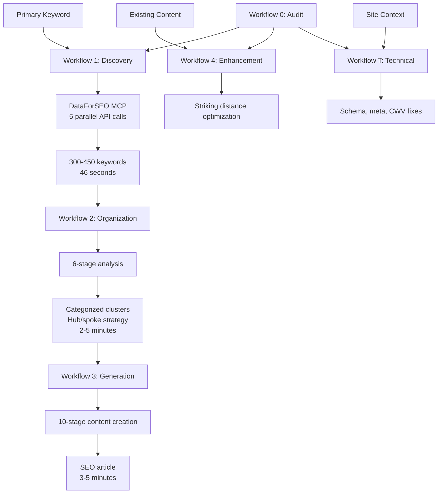

# SEO Skill Overview

Complete SEO system for keyword research, content generation, rank optimization, and technical implementation. Integrates with Growth Kit's copywriting methodology for human-quality content that ranks.

**Think of it as:** An SEO agency in a box. Research, create, optimize, and measure - all orchestrated through structured workflows.

---

## When to Use This Skill

**Use this skill when:**

- User needs keyword research for a topic/niche
- User wants to create SEO-optimized content
- User has existing content that needs rank improvement
- User needs technical SEO implementation guidance
- User wants to audit their current SEO position
- User mentions "SEO", "keywords", "ranking", "SERP", "organic traffic"

**Skip to specific workflow when:**

- User has a specific task ("research keywords for X", "optimize this page")
- User knows exactly which workflow they need
- User is continuing work from a previous workflow

---

## The Workflow System

### Core Workflows

| Workflow       | Purpose                          | Input                               | Output                                                    |
| -------------- | -------------------------------- | ----------------------------------- | --------------------------------------------------------- |
| **Workflow 0** | SEO Audit & Opportunity Analysis | Site URL, business context          | Positioning gaps, content inventory, KICP recommendations |
| **Workflow 1** | Keyword Discovery                | Primary keyword, location, language | 300-450 keywords via DataForSEO MCP                       |
| **Workflow 2** | Strategic Organization           | Workflow 1 output                   | Categorized clusters, content ideas, prioritized plan     |
| **Workflow 3** | Content Generation               | Content idea from Workflow 2        | Publication-ready SEO article                             |
| **Workflow 4** | Rank Enhancement                 | Existing content URL                | Optimized content for striking distance keywords          |
| **Workflow T** | Technical SEO                    | Site/page context                   | Schema, meta tags, redirects, Core Web Vitals fixes       |

### Supporting Resources

| Resource                               | Purpose                                     |
| -------------------------------------- | ------------------------------------------- |
| **prioritization-framework.md**        | Strategic decision layer for SEO priorities |
| **experiments-tracker.md**             | Testing methodology for SEO changes         |
| **content-brief-template.md**          | Handoff format for human writers            |
| **references/seo-master-reference.md** | Consolidated SEO reference guide            |

---

## System Architecture



## Workflow Dependencies

```
AUDIT LAYER (understand current state)
└── workflow-0-audit (Three Pillars: Positioning, Content Gap, Content Inventory)
        │
        ├── New content needed → DISCOVERY LAYER
        ├── Existing content needs work → ENHANCEMENT LAYER
        └── Technical issues found → TECHNICAL LAYER

DISCOVERY LAYER (find opportunities)
└── workflow-1-discovery (DataForSEO MCP - 300-450 keywords)
        │
        └── workflow-2-organization (Categorize, cluster, prioritize)
                │
                └── workflow-3-generation (Create content)

ENHANCEMENT LAYER (improve existing)
└── workflow-4-enhancement (Striking distance optimization)

TECHNICAL LAYER (fix infrastructure)
└── workflow-t-technical (Schema, meta, redirects, CWV)

MEASUREMENT LAYER (validate results)
└── experiments-tracker (Test, measure, iterate)
```

---

## Pre-Built Workflow Sequences

### Sequence 1: "Starting SEO From Zero"

**Situation:** New site/topic, need complete SEO foundation.

```
1. workflow-0-audit.md
   └── Establish baseline, identify gaps
   └── Input: Site URL, business context

2. workflow-1-discovery.md
   └── Discover keyword opportunities
   └── Input: Primary keyword from audit

3. workflow-2-organization.md
   └── Categorize and prioritize keywords
   └── Input: Workflow 1 output

4. workflow-3-generation.md (repeat for priority keywords)
   └── Create optimized content
   └── Input: Content ideas from Workflow 2

5. experiments-tracker.md
   └── Set up measurement framework
```

---

### Sequence 2: "I Have Keywords, Need Content"

**Situation:** Already know target keywords, need content creation.

```
1. workflow-3-generation.md
   └── Input: Keyword + title + description
   └── Specify tier: Compact (500-700) | Standard (1200-1600) | Comprehensive (2200-2800) | Authority (3000-3500+)
```

---

### Sequence 3: "Improve Existing Content"

**Situation:** Have content that's ranking poorly or in striking distance.

```
1. workflow-0-audit.md (optional)
   └── Identify which content to prioritize

2. workflow-4-enhancement.md
   └── Optimize for striking distance keywords
   └── Input: Content URL + target keywords
```

---

### Sequence 4: "Technical SEO Fixes"

**Situation:** Need schema, meta tags, redirects, or Core Web Vitals improvements.

```
1. workflow-t-technical.md
   └── Implementation guidance for specific issue
   └── Input: Site context + specific technical need
```

---

### Sequence 5: "Complete SEO Audit"

**Situation:** Comprehensive analysis before major SEO investment.

```
1. workflow-0-audit.md
   └── Three Pillars analysis
   └── KICP decision tree

2. prioritization-framework.md
   └── Strategic prioritization of opportunities

3. experiments-tracker.md
   └── Set up testing framework for changes
```

---

## Integration with Growth Kit

### Copywriting Enhancement (Workflow 3)

Workflow 3 integrates Growth Kit's psychological copywriting methodology:

**Framework Selection (based on content type):**

- Pain-point content → PAS (Problem-Agitation-Solution)
- Long-form guides → PASTOR (Problem-Amplify-Story-Transformation-Offer-Response)
- Comparison content → Feature-Benefit with BAB bridges
- Question content → Direct answer + PAS expansion

**Humanization Checklist (applied before final polish):**

- [ ] Specific person with specific viewpoint (not committee voice)
- [ ] Real experience showing through (stories, mistakes, specific numbers)
- [ ] Opinions defended with reasoning (not hedged)
- [ ] Unique insight or data present
- [ ] Voice recognizable without byline

**Cross-References:**

- `marketing/references/copywriting-frameworks.md` - Framework structures
- `marketing/references/human-content-patterns.md` - E-E-A-T examples
- `marketing/01-foundations/voice-profiler.md` - Brand voice consistency

### Foundation Dependencies

Before running SEO workflows, ensure these Growth Kit foundations exist:

| Foundation      | Why Needed               | Location                                     |
| --------------- | ------------------------ | -------------------------------------------- |
| Brand Voice     | Consistent content tone  | `marketing/01-foundations/voice-profiler.md` |
| Positioning     | Differentiated messaging | `marketing/01-foundations/hook-finder.md`    |
| Target Segments | Audience understanding   | `research/target-segments.md`                |

---

## Intake: Qualifying Questions

### Question 1: What's your current SEO state?

```
A) Starting from zero (new site/topic)
B) Have some content, need more
C) Have content that's not ranking well
D) Technical SEO issues
E) Need comprehensive audit
F) Not sure / need help figuring it out
```

**Routing:**

- A → Sequence 1 (Starting From Zero)
- B → Workflow 1 → 2 → 3
- C → Sequence 3 (Improve Existing)
- D → Sequence 4 (Technical Fixes)
- E → Sequence 5 (Complete Audit)
- F → Continue to Question 2

### Question 2: What do you have ready?

```
[ ] Primary keyword/topic identified
[ ] Keyword research completed
[ ] Content strategy/priorities defined
[ ] Existing content to optimize
[ ] Technical issues identified
```

**Routing:** Fill gaps in order (Audit → Discovery → Organization → Generation)

### Question 3: What's your immediate need?

```
A) Research keywords for a topic
B) Create new content
C) Improve existing content rankings
D) Fix technical SEO issues
E) Strategic planning/prioritization
```

**Routing:**

- A → Workflow 1 (Discovery)
- B → Workflow 3 (Generation)
- C → Workflow 4 (Enhancement)
- D → Workflow T (Technical)
- E → Prioritization Framework + Workflow 0

---

## DataForSEO MCP Dependency

**Workflow 1 requires the DataForSEO MCP server.**

**Tool Name:** `dataforseo-claudefast:claudefast_keyword_all_in_one`

**What It Does:**

- Executes 5 DataForSEO API endpoints in parallel
- Returns 300-450 keywords with metrics
- 90%+ token reduction vs raw API responses
- ~$0.30-0.40 per research run

**If MCP not available:** Use manual keyword research with web search tools.

---

## Performance Metrics

| Workflow             | Time        | Output                       | Token Efficiency                    |
| -------------------- | ----------- | ---------------------------- | ----------------------------------- |
| **W1: Discovery**    | 46 seconds  | 300-450 keywords             | 90%+ reduction (20K vs 130K tokens) |
| **W2: Organization** | 2-5 minutes | Clusters + 24+ content ideas | Markdown-native (no API bloat)      |
| **W3: Generation**   | 3-5 minutes | Publication-ready article    | Web search for real-time SERP       |

**Total pipeline:** ~10 minutes from keyword to published article

**Cost:** ~$0.30-0.40 per Workflow 1 research run (DataForSEO API)

---

## Key Innovations

1. **MCP-Optimized Discovery** - Single tool call replaces entire n8n/Airtable workflow with 90%+ token reduction
2. **Markdown-Native Pipeline** - All outputs are portable markdown artifacts (no vendor lock-in)
3. **Hub/Spoke Architecture** - 1 hub + 3 spokes per cluster = topical authority structure
4. **Flexible Tiers** - 4 word count options (500-3500+) with dynamic component proportions
5. **Growth Kit Integration** - Psychological copywriting frameworks + humanization patterns

---

## Quick Routing Reference

### By Goal

| Goal                 | First Workflow         | Then                     | Then                  |
| -------------------- | ---------------------- | ------------------------ | --------------------- |
| Find keywords        | workflow-1-discovery   | workflow-2-organization  | workflow-3-generation |
| Create content       | workflow-3-generation  | -                        | -                     |
| Improve rankings     | workflow-4-enhancement | -                        | -                     |
| Fix technical issues | workflow-t-technical   | -                        | -                     |
| Full SEO strategy    | workflow-0-audit       | prioritization-framework | appropriate workflow  |

### By What's Missing

| Missing                            | Run This                |
| ---------------------------------- | ----------------------- |
| Don't know what keywords to target | workflow-1-discovery    |
| Have keywords, need prioritization | workflow-2-organization |
| Need to create new content         | workflow-3-generation   |
| Content not ranking well           | workflow-4-enhancement  |
| Technical SEO problems             | workflow-t-technical    |
| Don't know where to start          | workflow-0-audit        |

---

## Content Tier Guidelines

Workflow 3 supports flexible word counts:

| Tier              | Words      | Use Case                                      |
| ----------------- | ---------- | --------------------------------------------- |
| **Compact**       | 500-700    | Quick Wins, Intent Signals, tactical posts    |
| **Standard**      | 1200-1600  | Authority Builders, detailed how-to guides    |
| **Comprehensive** | 2200-2800  | Deep dives, multi-section guides              |
| **Authority**     | 3000-3500+ | Hub articles, ultimate guides, pillar content |

**Default:** Compact (500-700 words) if not specified.

---

## The SEO Specialist Agent

For automated keyword research, use the `seo-specialist` agent:

```
Agent: seo-specialist
Purpose: Automated keyword research via DataForSEO MCP

Workflow:
1. Workflow 1 (Discovery) - MCP tool call
2. Workflow 2 (Organization) - Strategic analysis

Output: Two markdown files in .claude/seo-research/
```

**When to use agent vs manual:**

- **Agent:** Automated research, batch processing
- **Manual workflows:** Step-by-step control, learning, customization

---

## Anti-Patterns

### Don't:

- Skip Workflow 0 audit for established sites (you'll miss opportunities)
- Run Workflow 3 without voice/positioning defined (content will be generic)
- Ignore Workflow 4 for existing content (fastest ROI activity)
- Skip humanization checklist (content will read as AI-generated)
- Batch Workflow 3 outputs without review (quality varies)

### Do:

- Start with audit for established sites
- Ensure Growth Kit foundations before content creation
- Prioritize Workflow 4 for quick wins on existing content
- Apply humanization checklist to every piece
- Review and polish each Workflow 3 output

---

## Quality Gate

Before publishing any Workflow 3 output, verify:

1. **E-E-A-T signals present** - Experience, Expertise, Authority, Trust
2. **Copywriting framework applied** - PAS/PASTOR/BAB structure
3. **Human patterns evident** - Specific viewpoint, real examples, clear voice
4. **Keyword integration natural** - Not stuffed, contextually appropriate
5. **Tier word count met** - Within specified range

---

## The Test

Good SEO workflow execution means:

1. **User knows where to start** (clear routing)
2. **Workflows run in logical order** (dependencies respected)
3. **Outputs feed into next workflow** (no wasted work)
4. **Content is human-quality** (passes E-E-A-T check)
5. **Results are measurable** (experiments tracker in place)

If content reads as AI-generated after Workflow 3, the humanization stage failed.

---

_End of SEO Skill Overview_
