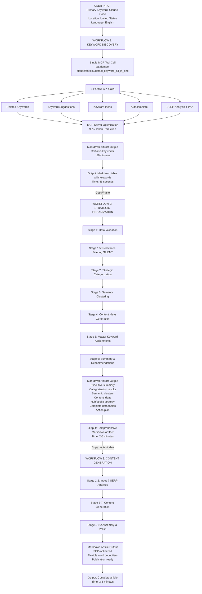

# SEO Research & Content System - Workflow Summary

Complete automated system for keyword research → strategic analysis → content generation

---

## Workflow 1: Keyword Discovery (Claude Desktop/Code + DataForSEO MCP)

**Platform:** Claude Desktop or Claude Code with custom DataForSEO MCP server  
**Input:** Single primary keyword (e.g., "Claude Code")  
**Process:** Single MCP tool call executes 5 DataForSEO API endpoints in parallel:
- Related Keywords (depth-first semantic search)
- Keyword Suggestions (containing target phrase)
- Keyword Ideas (category-based expansion)
- Autocomplete (Google suggestions)
- SERP Analysis (top 50 results + People Also Ask)

**Output:** Markdown artifact with 300-450 keyword variations  
**Execution Time:** <60 seconds (46 seconds average)  
**Status:** ✅ Production-ready, MCP-optimized

**Key Innovation:** Custom MCP server consolidates 5 API calls into one with 90%+ token reduction (20K vs 130K+ tokens), eliminating n8n and Airtable dependencies entirely.

---

## Workflow 2: Strategic Keyword Organization (Claude + Markdown)

**Platform:** Claude Desktop (or Claude API)  
**Input:** Markdown artifact from Workflow 1  
**Process:** In-memory analysis through 6 stages:
1. Data validation & relevance filtering (remove celebrity names, locations, unrelated terms)
2. Strategic categorization (Quick Wins, Authority Builders, Intent Signals, Emerging Topics, Semantic Topics)
3. Semantic clustering (4-6 thematic content clusters)
4. Content idea generation (category-based + hub/spoke architecture)
5. Master keyword assignments
6. Execution summary & recommendations

**Output:** Single comprehensive Markdown artifact with:
- 300-450 categorized keywords
- 4-6 semantic clusters with thematic grouping
- Category-based content ideas for Quick Wins, Authority Builders, Intent Signals
- Hub/Spoke strategy: 1 pillar hub + 3 supporting spokes per cluster = 24+ strategic articles
- Complete data tables for downstream workflows
- Prioritized action plan

**Execution Time:** 2-5 minutes for 300-450 keywords  
**Capacity:** Handles up to 450 keywords per session  
**Status:** ✅ Production-ready (V5 optimized)

**Key Optimization:** Markdown input (vs Airtable MCP) eliminates 100+ API calls and context bloat. Artifact becomes standalone resource for Workflow 3.

---

## Workflow 3: Content Generation (Claude + Markdown)

**Platform:** Claude Desktop (or Claude API)  
**Input:** Content ideas from Workflow 2 artifact  
**Process:** Autonomous execution through 10 stages:
1. Input validation & SERP analysis via web_search
2. Title optimization (3-5 options)
3. Key takeaways generation (4-12 based on tier)
4. Introduction (20-25% of word count)
5. Outline generation (2-8 sections based on tier)
6. Main body content (55-65% of word count)
7. Conclusion (15-20% of word count)
8. Article assembly
9. Final polish & expansion
10. Meta description & SEO reference

**Output:** SEO-optimized article in 4 flexible word count tiers:
- **Compact:** 500-700 words (tactical, focused content)
- **Standard:** 1200-1600 words (comprehensive how-to)
- **Comprehensive:** 2200-2800 words (deep-dive guides)
- **Authority:** 3000-3500+ words (pillar/hub content)

**Execution Time:** 3-5 minutes per article  
**Default Tier:** Compact (500-700 words)  
**Status:** ✅ Production-ready (V2 with flexible word counts)

**Key Features:** Dynamic component proportions (Intro 20-25%, Body 55-65%, Conclusion 15-20%), real-time SERP analysis, 3-5 title options, publication-ready markdown format.

---

## System Architecture



---

## Key Benefits

**Complete Automation:** One-click keyword discovery → strategic analysis → content generation

**Zero External Dependencies (Workflow 1):** 
- No n8n automation platform required
- No Airtable database required
- No CSV exports required
- Runs entirely in Claude Desktop/Code with MCP

**Token Efficiency:** 
- Workflow 1: 90%+ reduction (20K vs 130K+ tokens) via optimized MCP server
- Workflow 2: Markdown input eliminates 100+ Airtable API calls
- Workflow 3: Web search for real-time SERP analysis

**Scalability:** 
- Handles 300-450 keywords per research run
- Can process multiple primary keywords sequentially
- Flexible word count tiers (500-3500+ words)

**Speed:**
- Workflow 1: 46 seconds average
- Workflow 2: 2-5 minutes
- Workflow 3: 3-5 minutes per article
- **Total:** ~10 minutes from keyword to published article

**Quality Output:**
- 96%+ categorization accuracy
- Strategic clustering for content architecture
- Prioritized action plans (Quick Wins → Authority Builders)
- Hub/Spoke content strategy for topical authority
- SEO-optimized articles (9.5+/10 quality)

**Data Portability:**
- Markdown artifacts (shareable, uploadable to any LLM)
- Human-readable format
- Version-controllable
- No vendor lock-in

---

## Workflow Comparison: Old vs New

### Workflow 1: Keyword Discovery

| Aspect | Old (n8n + Airtable) | New (MCP + Claude) |
|--------|---------------------|-------------------|
| Platform | n8n automation + Airtable | Claude Desktop/Code + MCP |
| Steps | 6+ (webhook, API calls, transform, store, export) | 1 (single tool call) |
| Time | 2-3 minutes | 46 seconds |
| Dependencies | n8n, Airtable, CSV export | None (MCP only) |
| Output | CSV file from Airtable | Markdown artifact |
| Token Usage | Massive (130K+) | Minimal (20K, 90% reduction) |
| Handoff to W2 | Manual CSV upload | Copy/paste or same session |

### Workflow 2: Strategic Organization

| Aspect | Old (CSV Input) | New (Markdown Input) |
|--------|----------------|---------------------|
| Input | CSV file upload | Markdown artifact |
| Processing | Parse CSV, 100+ API calls if using Airtable MCP | Direct markdown parsing |
| Context Bloat | Significant with Airtable MCP | Minimal with markdown |
| Output | Markdown artifact | Markdown artifact (same) |
| Status | ✅ Working | ✅ Optimized (V5) |

### Workflow 3: Content Generation

| Aspect | Status |
|--------|--------|
| Input | Workflow 2 content ideas |
| Processing | 10-stage autonomous execution |
| Word Counts | 4 flexible tiers (500-3500+) |
| Output | SEO-optimized articles |
| Status | ✅ Production-ready (V2) |

---

## Current System Flow

### End-to-End Execution

**Step 1: Keyword Discovery (46 seconds)**
```
User: "Run Workflow 1 for 'Claude Code'"
Claude: [Executes MCP tool call]
Output: Markdown artifact with 445 keywords
```

**Step 2: Strategic Organization (2-5 minutes)**
```
User: [Copy W1 artifact] → New session → "Execute Workflow 2 on this data"
Claude: [Processes 445 keywords]
Output: Markdown artifact with:
  - Categorized keywords
  - 6 semantic clusters
  - 24+ content ideas (hub/spoke strategy)
  - Prioritized action plan
```

**Step 3: Content Generation (3-5 minutes)**
```
User: [Copy content idea] → "Execute Workflow 3 on this content idea"
Claude: [10-stage content generation]
Output: 500-3500 word SEO-optimized article
```

**Total Time:** ~10 minutes from keyword to published article

---

## Current Status

| Workflow | Platform | Status | Output |
|----------|----------|--------|--------|
| 1: Keyword Discovery | Claude + MCP | ✅ Production | 300-450 keywords in markdown |
| 2: Strategic Organization | Claude + Markdown | ✅ Production (V5) | Categorized analysis + content ideas |
| 3: Content Generation | Claude + Web Search | ✅ Production (V2) | SEO-optimized articles (4 tiers) |

**System Status:** Fully operational, zero external dependencies (except DataForSEO API for W1)

---

## Recommended Usage

### Single Article Production

1. **Run Workflow 1** (46 seconds)
   - Input: Primary keyword
   - Output: Markdown artifact with keywords

2. **Run Workflow 2** (2-5 minutes)
   - Input: Workflow 1 markdown artifact
   - Output: Strategic analysis + content ideas

3. **Run Workflow 3** (3-5 minutes)
   - Input: Single content idea from Workflow 2
   - Output: Publication-ready article

**Total:** ~10 minutes, one complete article

### Batch Content Production

1. **Run Workflow 1** once per primary keyword
2. **Run Workflow 2** once per keyword set
3. **Review "Workflow 3 Ready Content Ideas"** section
4. **Run Workflow 3** multiple times (one per content idea)
5. **Publish** articles in priority order (Quick Wins → Authority Builders)

**Efficiency:** One Workflow 1+2 execution yields 24+ content ideas (hub/spoke strategy)

---

## Key Innovations

### 1. MCP-Optimized Keyword Discovery
- Single tool call replaces entire n8n workflow
- 90%+ token reduction through smart filtering
- 46-second execution vs 2-3 minutes
- Zero external dependencies

### 2. Markdown-Native Pipeline
- All workflow outputs are markdown artifacts
- Copy/paste between sessions
- Human-readable format
- No vendor lock-in
- Easy to version control

### 3. Flexible Word Count System
- 4 tiers: Compact (500-700) → Authority (3000-3500+)
- Dynamic component proportions
- Default to Compact for efficiency
- Scale up for hub/pillar content

### 4. Hub/Spoke Content Architecture
- 1 comprehensive hub per cluster
- 3 supporting spokes per hub
- Internal linking strategy
- Topical authority building

---

*Last Updated: October 2025*  
*Version: 2.0 (MCP-Optimized)*